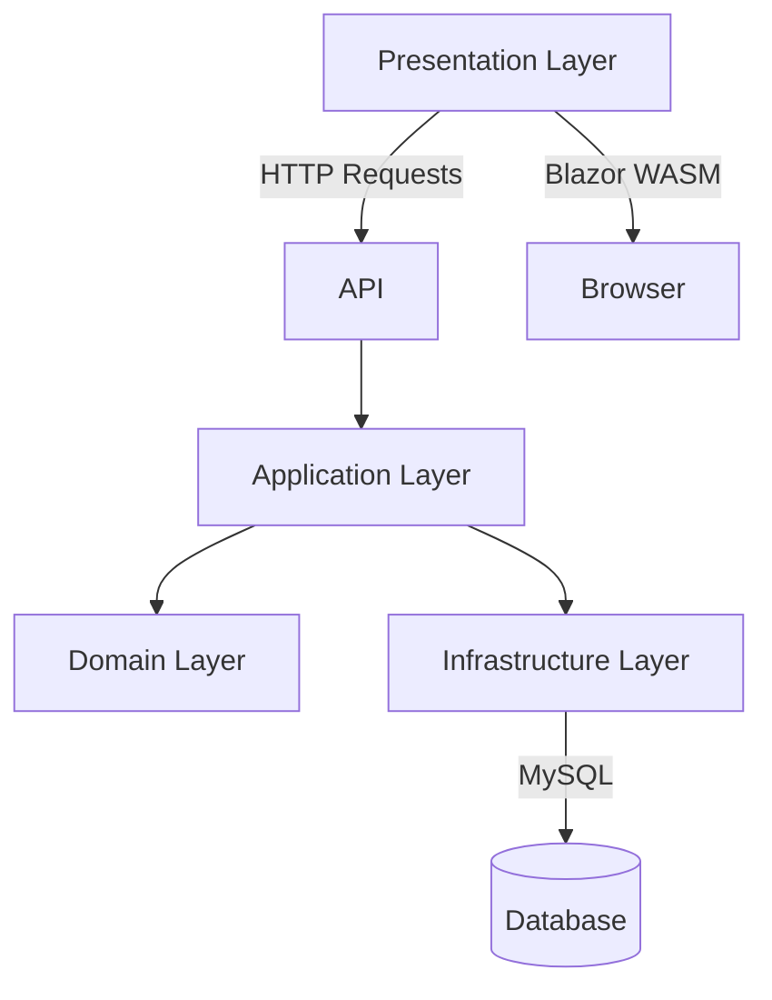
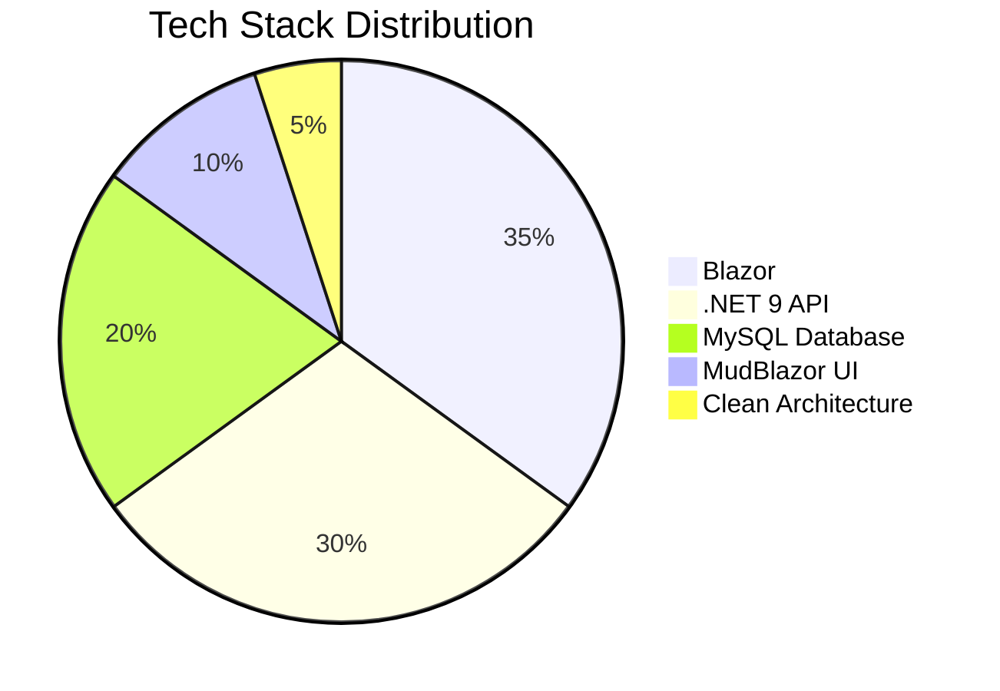

# 🚀 Go Delivery System – Smart Local Delivery Platform  

[](https://dotnet.microsoft.com/en-us/apps/aspnet/web-apps/blazor)
[](https://mudblazor.com/)
[](https://www.mysql.com/)
[](LICENSE)

## 📘 Project Introduction

**Go Delivery System** is a local order and delivery management platform designed specifically for small business owners. It helps them manage daily operations efficiently and accurately—without relying on traditional paperwork.

## 🌟 Support the Project

⭐ [Star us on GitHub](https://github.com/MohammedBagowabair/DeliverySystem) — your support fuels further development!

[](https://www.linkedin.com/in/mohammed-bagowabair-77a0a72aa)

---

## 🏆 Key Features

### 🛠️ Core Functionality
- 📦 **Order Management** (Create/Edit/Track)
- 🚚 **Driver Assignment System**
- 📊 **Real-time Dashboard**
- 👥 **Multi-role Access Control** (Admin, Drivers, Customers)
- 📈 **Advanced Reporting** (Daily/Weekly/Monthly)

### ⚙️ Technical Highlights
- 🏗️ **Clean Architecture** Implementation
- 🧩 **CQRS Pattern** with MediatR
- 🔄 **AutoMapper** for DTO transformations
- ✅ **FluentValidation** for robust input validation
- 🗃️ **MySQL Database** Integration
- 🖥️ **Blazor WebAssembly** Client

---

## 🖼️ Visual Showcase

### 📊 Dashboard


### 📦 Today's Orders


### ➕ Add New Order


### 👤 Add Customer


### 🚗 Add Connector


### ✏️ Edit Connector


### 🔄 Change Connector


### 📝 Connector Details


### 📊 Simple Reports


### 👥 Users Management


---

## 🌐 Hosting & Availability

- 🖥️ Runs on **local hosting** with no extra cost — only a computer is required
- ☁️ **Optional online hosting** available on request

---

## 🏗️ Development Notes

- System is fully developed in **Arabic** and being translated to support **multiple languages** soon
- Currently serving **multiple active clients** and under continuous development
- Expect improvements in the dashboard, reporting, and UX in upcoming versions

---

## ⚠️ Known Limitations

- Some screens may have spelling or grammar inconsistencies due to automatic translation
- UI is optimized for Arabic display; localization support is in progress
- Further features and delivery app integrations are planned

---

## 📌 Technologies Used

- **Frontend**: Blazor, MudBlazor, HTML, CSS, JavaScript  
- **Backend**: .NET API  
- **PDF Generation**: Server-side reporting engine  
- **Database**: MySQL  
- **Architecture**: Clean Architecture with CQRS  
- **Tools**: MediatR, AutoMapper, FluentValidation

---

## 🛠️ Installation Guide

### Prerequisites
- .NET 9 SDK
- MySQL 8.0+

### Setup Instructions

1. **Clone the repositories**:
```bash
# Backend
git clone https://github.com/MohammedBagowabair/DeliverySystem.git

# Frontend
git clone https://github.com/MohammedBagowabair/DeliverySystemClientUI.git

```
## 🏗️ System Architecture


## 💻 Technology Stack

🤝 Contributing
Pull requests are welcome! For major changes, please open an issue first to discuss.

📄 License
Proprietary - © 2024 Mohammed Bagowabair
